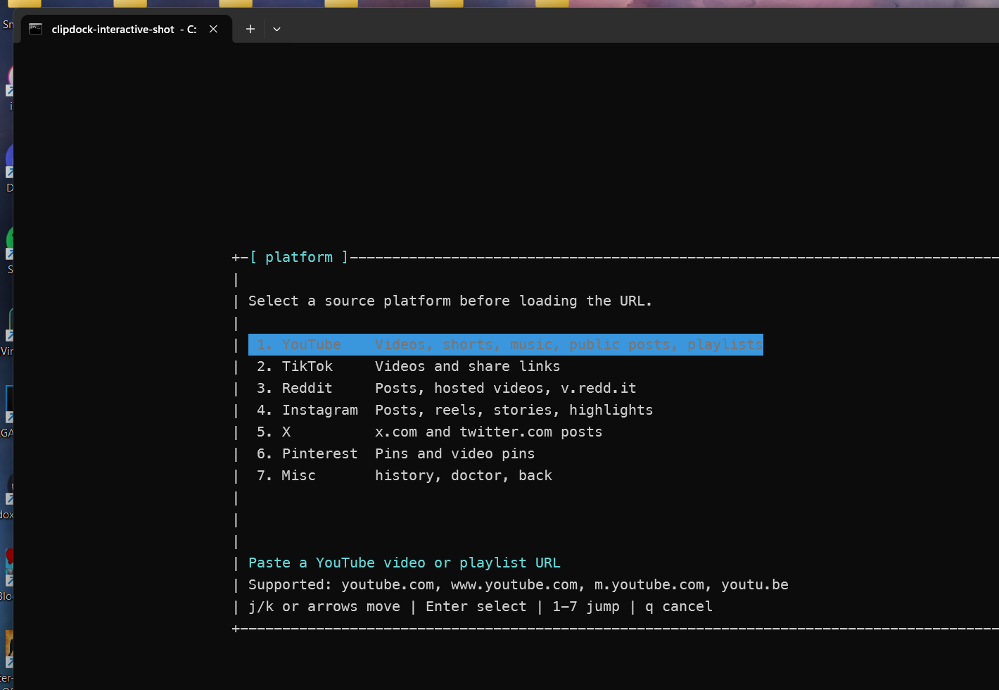
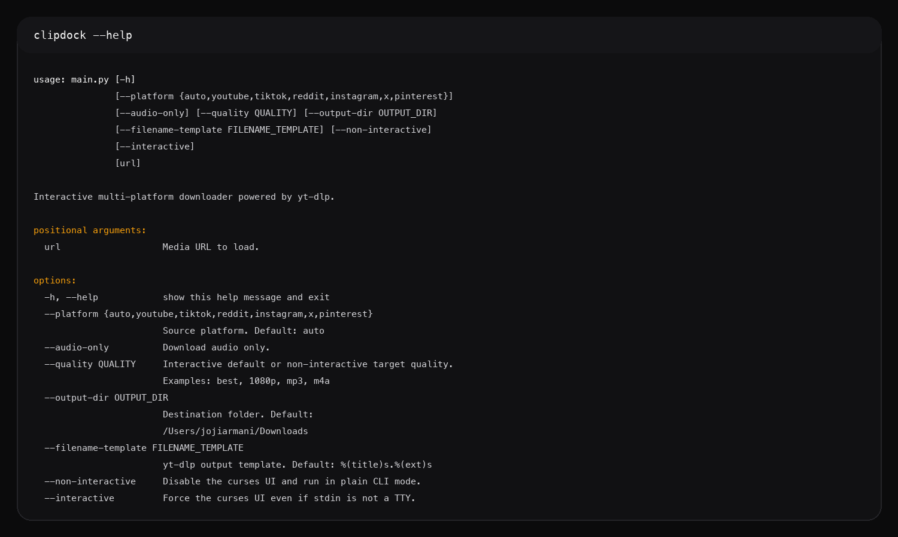

# clipdock

Terminal-first media downloader built on `yt-dlp`, with an interactive curses UI, packaged CLI, named presets, duplicate detection, batch jobs, richer output options, and clipboard watch mode.


## Preview

Real screenshots from the current app:

<p align="center">
  
</p>

<p align="center">
  
</p>

## Overview

`clipdock` is for people who want a fast local downloader without a browser extension or desktop wrapper.

It supports:

- a guided terminal UI for selecting platform, URL, mode, quality, output path, and playlist queue
- in-app `history`, `doctor`, `formats`, `simulation`, auth, extras, and watch-settings panels inside the interactive UI
- a plain CLI for scripting and diagnostics
- named presets for repeatable download workflows
- batch jobs from newline-delimited URL files
- duplicate detection before download
- persistent clipboard watch mode for daily-use automation

## Highlights

| Capability | Details |
| --- | --- |
| Interactive terminal app | Full-screen curses interface with keyboard navigation |
| Packaged CLI | `clipdock "<url>"`, `python -m clipdock`, and editable installs |
| Presets | Save reusable download profiles such as `music` or `youtube-1080` |
| Output extras | Subtitles, auto-subs, thumbnails, info JSON, embedded metadata, chapter splitting, and video remuxing |
| Batch jobs | Run newline-delimited URL files with duplicate safety and summary output |
| Duplicate handling | Detect existing downloads by extractor/media ID when available, then fall back to normalized URLs |
| Clipboard watch | Run foreground or background clipboard monitoring with persistent seen-state |
| History and doctor | Inspect prior downloads and verify local runtime health |
| Diagnostics | Inspect formats, simulate downloads, and enable debug reports |
| Session support | Cookie-file and browser-cookie auth for restricted media |

## Supported Platforms

| Platform | Notes |
| --- | --- |
| YouTube | Videos, shorts, music, public posts, playlists |
| TikTok | Videos and share links |
| Reddit | Posts, hosted videos, `v.redd.it` |
| Instagram | Posts, reels, stories, highlights |
| X / Twitter | Post URLs from `x.com` and `twitter.com` |
| Pinterest | Pins and video pins |
| Vimeo | Public videos and showcases |
| Facebook | Posts, reels, and watch URLs |
| Twitch | Clips and VOD URLs |

Support depends on what `yt-dlp` can extract successfully from the source.

## Requirements

- Python 3.12 or newer
- optional but strongly recommended: `ffmpeg`
- Windows interactive mode uses `windows-curses`, installed automatically with the package

Without `ffmpeg`:

- video downloads still work
- audio conversion profiles such as MP3 and M4A are unavailable
- some best-quality muxing paths are reduced

## Installation

### End-user install

```bash
pipx install clipdock
```

### Contributor / local install

```bash
python -m venv .venv
source .venv/bin/activate
pip install -e .
```

### Compatibility entrypoint

`python main.py` still works, but the primary interface is now the packaged `clipdock` command.

### Optional: install ffmpeg

On macOS with Homebrew:

```bash
brew install ffmpeg
```

## Quick Start

### Interactive mode

```bash
clipdock
```

After a successful interactive download, press `N` on the completion screen to jump straight to another URL while keeping the current platform and output settings.

### Direct download

```bash
clipdock "https://www.youtube.com/watch?v=example"
```

### Non-interactive mode

```bash
clipdock --non-interactive --platform youtube --quality 1080p "https://www.youtube.com/watch?v=example"
```

### Audio-only export

```bash
clipdock --non-interactive --audio-only --quality mp3 "https://www.youtube.com/watch?v=example"
```

### Download a YouTube playlist

```bash
clipdock --non-interactive --playlist "https://www.youtube.com/playlist?list=example"
```

### Inspect available formats

```bash
clipdock --non-interactive --list-formats "https://www.reddit.com/video/example"
```

### Simulate without downloading

```bash
clipdock --non-interactive --simulate --quality 720p "https://www.youtube.com/watch?v=example"
```

### Use browser cookies for restricted media

```bash
clipdock --non-interactive --cookies-from-browser chrome "https://www.instagram.com/reel/example/"
```

### Save metadata extras

```bash
clipdock --non-interactive --write-subs --sub-lang en --write-thumbnail --write-info-json "https://www.youtube.com/watch?v=example"
```

### Run a batch file

```bash
clipdock batch urls.txt --preset music
```

## Presets

Create a preset:

```bash
clipdock preset create music --audio-only --quality mp3 --output-dir ~/Music/Clips
```

Show or list presets:

```bash
clipdock preset show music
clipdock preset list
```

Use a preset directly:

```bash
clipdock use music "https://www.youtube.com/watch?v=example"
clipdock --preset music "https://www.youtube.com/watch?v=example"
```

Presets are stored in the user config file:

- Linux example: `~/.config/clipdock/config.toml`
- Windows example: `%AppData%\clipdock\config.toml`

Example:

```toml
[presets.music]
audio_only = true
quality = "mp3"
output_dir = "~/Music/Clips"
filename_template = "%(uploader)s - %(title)s.%(ext)s"
write_thumbnail = true
write_info_json = true
```

## Duplicate Detection

Before downloading, `clipdock` checks the local history database. When yt-dlp exposes a stable extractor/media ID, clipdock uses that identity first. If not, it falls back to normalized URL matching.

Example flow:

```text
duplicate  This URL was already downloaded on 2026-05-07T00:11:00+00:00:
path       C:\Users\Joey\Downloads\clipdock\video-title.mp4
Download again? [y/N]
```

Duplicate utilities:

```bash
clipdock history
clipdock history --platform youtube --limit 10
clipdock history --status missing --query reels
clipdock history export --format json
clipdock history prune-missing
clipdock history open 42
clipdock history redownload 42
clipdock duplicates
clipdock duplicates --hash
clipdock clean-duplicates
clipdock clean-duplicates --hash --dry-run
```

History output includes the recorded platform, preset, quality, file path, and the duplicate identity key used for matching.

Default cleanup behavior:

- group duplicates by normalized URL unless `--hash` is used
- keep the newest existing file
- ask before deleting the older files

## Clipboard Watch Mode

Watch the clipboard in the foreground and prompt when a supported URL appears:

```bash
clipdock watch run
```

Use a preset:

```bash
clipdock watch run --preset music
```

Auto-download with duplicate safety:

```bash
clipdock watch run --auto --preset music
```

Start the background watcher:

```bash
clipdock watch start --preset music --auto
clipdock watch status
clipdock watch stop
```

Watch mode behavior:

- polls the clipboard every `0.75` seconds by default
- detects the first supported URL in the clipboard text
- ignores repeated clipboard content
- skips URLs already seen in prior watch sessions
- prompts with platform, title, preset, and duplicate warning unless `--auto` is enabled

## CLI Commands

| Command | Purpose |
| --- | --- |
| `clipdock "<url>"` | Standard download flow |
| `clipdock use <preset> "<url>"` | Download with a named preset |
| `clipdock batch <file>` | Run newline-delimited batch downloads |
| `clipdock watch run/start/stop/status` | Watch the clipboard in foreground or background |
| `clipdock history` | Show recent download history |
| `clipdock preset create/list/show/delete` | Manage named presets |
| `clipdock duplicates` | Show duplicate downloads |
| `clipdock clean-duplicates` | Remove duplicate files after confirmation |
| `clipdock doctor` | Check local dependencies and writable paths |

Core flags still apply to the download flow:

- `--platform`
- `--audio-only`
- `--playlist`
- `--quality`
- `--output-dir`
- `--filename-template`
- `--write-subs` / `--write-auto-subs` / `--sub-lang` / `--embed-subs`
- `--write-thumbnail` / `--embed-thumbnail`
- `--write-info-json` / `--embed-metadata`
- `--split-chapters` / `--remux-video`
- `--preset`
- `--force`
- `--non-interactive`
- `--interactive`
- `--list-formats`
- `--simulate`
- `--debug`
- `--cookies`
- `--cookies-from-browser`

## Interactive Controls

### Platform picker

- `j` / `k` or arrow keys to move
- number keys to jump to a platform
- `Enter` to confirm
- `q` to cancel

### Main screen

- `j` / `k` or arrows to move between command groups
- `Enter` to open the selected group or start the download
- number keys `1-6` to jump between command rows
- `q` to exit

Main command groups:

- `source` for platform, preset, URL, and auth settings
- `download` for playlist mode, queue management, mode, and quality
- `output` for destination folder, filename template, and extras
- `inspect` for formats and simulation views

The initial platform picker still exposes `misc` for:

- `history` to inspect recent downloads without leaving the UI
- `doctor` to inspect runtime health without leaving the UI
- `watch` settings to edit saved watch defaults

### Playlist queue

- open `queue` after loading a playlist
- `j` / `k` or arrows move between entries
- `Enter` or `Space` toggles the selected item in or out of the queue
- `d` or `Delete` removes the selected item from the queue
- `r` restores the selected item
- `a` restores the full playlist queue
- `q` closes the queue view

Interactive duplicate detection now prompts before starting a duplicate transfer.

## Doctor

Run:

```bash
clipdock doctor
```

Current checks:

- Python runtime
- `ffmpeg` availability
- clipboard access
- config and state path writability
- history database accessibility
- default output directory writability
- curses availability for interactive mode

## Project Layout

```text
main.py            compatibility entrypoint
pyproject.toml     package metadata and console script
clipdock/          CLI, UI, downloader, config, history, watcher, diagnostics
tests/             pytest regression suite
docs/              additional usage notes
```

## Notes

- this project is a thin local app around `yt-dlp`, not a hosted service
- extraction behavior can change as upstream sites change
- success depends on the current extractor support in `yt-dlp`

## Contributing

See [CONTRIBUTING.md](./CONTRIBUTING.md).
